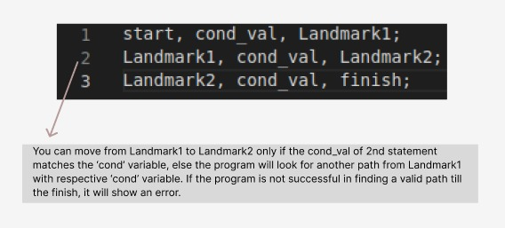

# IITK - Traveller

IITK - Traveller is an esoteric language designed by Programming Club,IIT Kanpur. Started as a fun winter project, the construct of the language is partailly inspired by esolangs 3var and Taxi, and its major goal is to introduce IITK peeps to esolangs and provide them with a relatable, challenging and creative construct, in case they have been bored using the similar language constructs like C/C++,Java,Python etc.

## Theme

A traveller, with the help of 4 boxes + book in his/her bag, wishes to travel IITK in order to reach to their final destination. They also wish that their journey is meaningful, so they want to leave their token of visit as an output after they have finished travelling. You, being familiar with IITK have to help them by planning their journey through landmarks of IITK while making use of the boxes and the book to help them accomplish their task.

## Language Overview

The book represents a memory tape which is an integer array(namely mem[]), of length 2048. The first three boxes represent 3 variables(namely mem_1, mem_2, and mem_3), which represent the indices of the array specified above. The last of the boxes represents a condition variable(namely cond), which can intake any integer value. The IITK landmarks will represent the supported commands.
As per the language construct, the user needs to travel from one landmark to the other depending on the current value of condition variable. 

## Language Specifications

The construct of the language works in the manner that you visit various landmarks denoting different operations. Each statement of the langauge is described visually as:   

  

Therefore, one can think of a program as initialising a graph of operations by carefully manipulating the given variables(especialy the condition variable) and deciding the landmarks and their linkages such that finally the task is accomplished. (<em>ESC201 Flashbacks Intensify</em>)

## Initializations

The `mem[]` array is initialized to 0. The initial values of `mem_1, mem_2, mem_3` are 0,1,2 respectively. The `cond` variable is initialized to 0.
The starting landmark is `start` and the ending landmark is `finish`.

## Commands and Expressions

<table>
<tr><th>IITK LANDMARK              </th><th>            COMMAND</th></tr>
<tr><td>start                      </th><td>            start</th></td>
<tr><td>finish                     </th><td>            finish</th></td>
<tr><td>iit_gate_in_1              </th><td>            input to mem[mem_1]</th></td>
<tr><td>iit_gate_in_2              </th><td>            input to mem[mem_2]</th></td>
<tr><td>hall_2                     </th><td>            mem[mem_3] = mem[mem_1] + mem[mem_2]</th></td>
<tr><td>hall_3                     </th><td>            mem[mem_3] = mem[mem_1] * mem[mem_2]</th></td>
<tr><td>hall_5                     </th><td>            mem[mem_3] = mem[mem_1] - mem[mem_2]</th></td>
<tr><td>hall_12                    </th><td>            mem[mem_3] = mem[mem_1] / mem[mem_2]</th></td>
<tr><td>mt_1_3                     </th><td>            mem[mem_1] = mem[mem_3]</th></td>
<tr><td>mt_3_1                     </th><td>            mem[mem_3] = mem[mem_1]</th></td>
<tr><td>mt_2_3                     </th><td>            mem[mem_2] = mem[mem_3]</th></td>
<tr><td>mt_3_2                     </th><td>            mem[mem_3] = mem[mem_2]</th></td>
<tr><td>iit_gate_out_1             </th><td>            output mem[mem_1]</th></td>
<tr><td>iit_gate_out_2             </th><td>            output mem[mem_2]</th></td>
<tr><td>lecture_hall_gt            </th><td>            mem[mem_1] > mem[mem_2]</th></td>
<tr><td>lecture_hall_gt_t          </th><td>            path followed if lecture_hall_gt is true</th></td>
<tr><td>lecture_hall_gt_f          </th><td>            path followed if lecture_hall_gt is false</th></td>
<tr><td>lecture_hall_lt            </th><td>            mem[mem_1] < mem[mem_2]</th></td>
<tr><td>lecture_hall_lt_t          </th><td>            path followed if lecture_hall_lt is true</th></td>
<tr><td>lecture_hall_lt_f          </th><td>            path followed if lecture_hall_lt is false</th></td>
<tr><td>lecture_hall_eq            </th><td>            mem[mem_1] == mem[mem_2]</th></td>
<tr><td>lecture_hall_eq_t          </th><td>            path followed if lecture_hall_eq is true</th></td>
<tr><td>lecture_hall_eq_f          </th><td>            path followed if lecture_hall_eq is false</th></td>
<tr><td>oat_stairs_1               </th><td>            mem[mem_1]++</th></td>
<tr><td>oat_stairs_2               </th><td>            mem[mem_2]++</th></td>
<tr><td>oat_stairs_c               </th><td>            cond++</th></td>
<tr><td>southern_labs_1            </th><td>            mem[mem_1]--</th></td>
<tr><td>southern_labs_2            </th><td>            mem[mem_2]--</th></td>
<tr><td>southern_labs_c            </th><td>            cond--</th></td>
<tr><td>hall_13_1                  </th><td>            mem[mem_1] = 0</th></td>
<tr><td>hall_13_2                  </th><td>            mem[mem_2] = 0</th></td>
<tr><td>hall_13_3                  </th><td>            mem[mem_3] = 0</th></td>
<tr><td>hall_13_c                  </th><td>            cond = 0</th></td>
<tr><td>rm_1                       </th><td>            mem_1++</th></td>
<tr><td>rm_2                       </th><td>            mem_2++</th></td>
<tr><td>rm_3                       </th><td>            mem_3++</th></td>
<tr><td>kd_1                       </th><td>            mem_1--</th></td>
<tr><td>kd_2                       </th><td>            mem_2--</th></td>
<tr><td>kd_3                       </th><td>            mem_3--</th></td>
</table>

